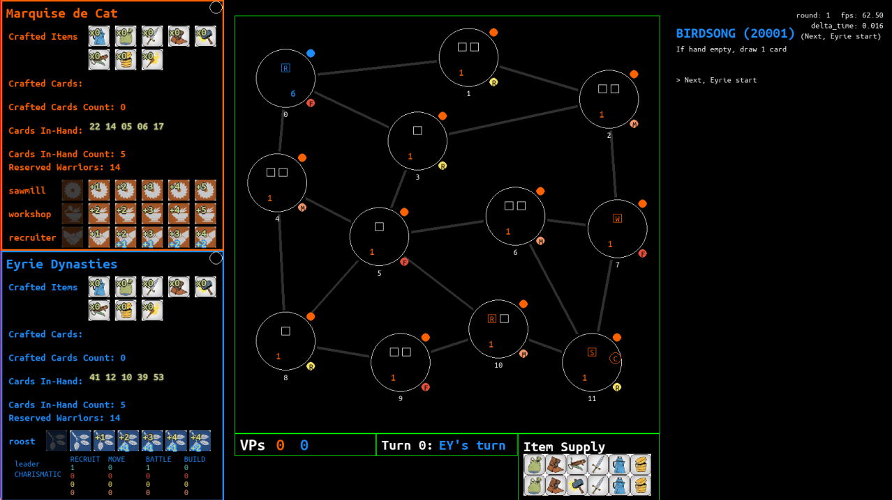

# RootAI

## Table of Contents
- [RootAI](#rootai)
  - [Table of Contents](#table-of-contents)
  - [Running the Project](#running-the-project)
    - [Prerequisite](#prerequisite)
    - [Setup](#setup)
      - [For IntelliJ](#for-intellij)
      - [For VSCode](#for-vscode)
    - [Running the Game](#running-the-game)
      - [Option 1 - Run inside IntelliJ](#option-1---run-inside-intellij)
      - [Option 2 - Run via command line](#option-2---run-via-command-line)
    - [Exporting](#exporting)
  - [Download and Running the exe](#download-and-running-the-exe)
  - [Controls](#controls)
  - [Technical](#technical)
    - [The AI agent](#the-ai-agent)
    - [Action generation](#action-generation)

## Running the Project

It is RECOMMENDED that you:
- know Root boardgame's rules
- or have played before
- or have a rule book with you

### Prerequisite

- python 11.3+
- libraries
  - `pygame 2.4.0+` — `pip install pygame`
    - (not recommended, un-maintained) `conda install -c conda-forge pygame`
  - `yaml` — `pip install pyyaml`
  - `numpy` — `pip install numpy`
  - `pathos` — `pip install pathos`
  - `scipy` — `pip install scipy`

### Setup
#### For IntelliJ
1. Add a new Python configuration (top right)
   - set name: `Run main.py`
   - set Script path: `.\main.py`
   - set Environment > Working directory to absolute path to `src`
     - eg. `D:\GitHub\RootAI\src`
2. Go to Settings > CodeStyle > Cogs icon > Import scheme > import `codestyle.xml` 
#### For VSCode
1. You should be able to just run via command line with the instruction below

### Running the Game
#### Option 1 - Run inside IntelliJ
1. Run `Run main.py` to run the game
#### Option 2 - Run via command line
1. cd to `.\src`
2. run python with config file path as arg `python -m main ".\config\config.yml"`

### Exporting
1. cd to root of project
2. Run `pyinstaller .\src\main.py`
3. Copy `.\src\assets` to `.\dist\main` and `\.src\config\config.yml` to `.\dist\main\config`

## Download and Running the exe

1. download the RootAI from the releases tab: https://github.com/iambaangkok/RootAI/releases
2. either:
   1. double click `RootAI.exe`
   2. run via command line `./RootAI.exe`
3. config file is in `/config/config.yml`, change to match your needs.
   1. Eyrie is set to be the mcts AI agent
   2. Marquise is the player
   3. Eyrie starts first

## Controls
No mouse controls
- Press UP/DOWN --- change selected action
- Press R --- random action
- Press RETURN/SPACE --- execute selected action
- Press O --- print_game_state
- Press C --- new_game_from_current_game_state
- Hold F --- continuously run player
- Hold A --- continuously run agent
- Press N in game-end state --- new game
- Press Q in game-end state --- quit game

## Technical
### The AI agent
The AI agent uses Monte Carlo Tree Search (MCTS) to simulate into to future and pick the "best" possible action at the current game state.

### Action generation
Each action generation sequence corresponds to a 5 digit-number.
- Digit 0: faction = 1 (Marquise) | 2 (Eyrie) | 9 (Neutral)
- Digit 1-4: distinct id for that method

e.g.
- 10001 = action generation sequence 1 for Marquise

